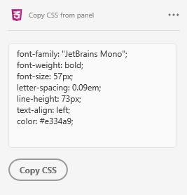

# Copy-CSS-from-panel
 
Plugin for Adobe XD that allows you to copy CSS styles

Download this repo to your computer  
Important: Change the id in manifest.json 
Launch XD and go to Plugins > Development > Show Develop Folder 
Place this entire repo in a subfolder in this location 
In XD, run Plugins > Development > Reload Plugins (or quit & relaunch XD)
